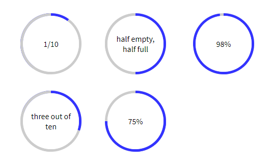

# scss-progress-circle-border
A pure (S)CSS based circle border or respectively ring

Preprocess the SCSS to CSS and use it with the html to show circles with different border fillins to show some progress.

